## Background

This analysis examines data collected from $n = 38$ hunters to assess whether a hunter's age and number of treks predict the number of armadillos hunted, and whether an interaction between the two predictors is needed.

The proposed model is:

$$\text{Armadillos} \sim \text{Age} + \text{Treks} + \text{Age} \times \text{Treks}$$

Because the outcome is a count variable, count regression models (Poisson and Negative Binomial) are used from the Count Regression Dashboard.

---

## Data Preview

The dataset (`McMillanAcheArmadillo.csv`) contains four variables: **Hunter** (ID), **Age**, **Armadillos** (count), and **Treks**. A sample of the first rows is shown below.

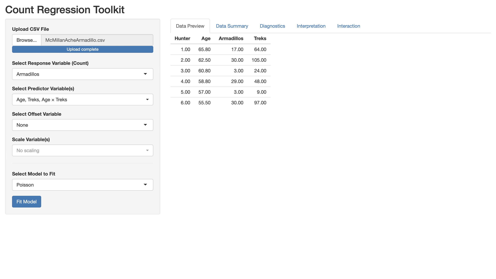{width=80%}

---

## Data Summary

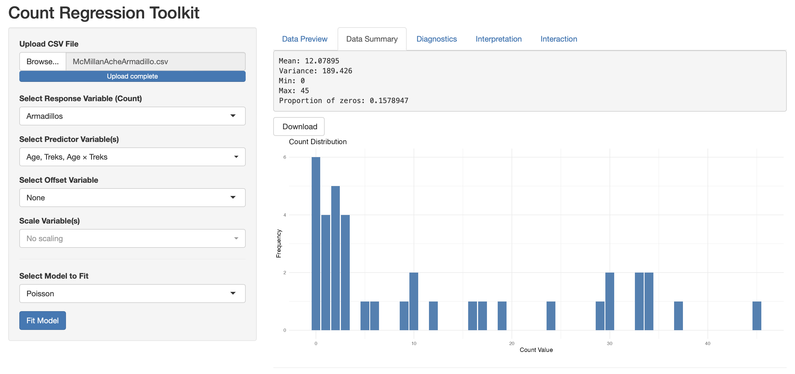{width=85%}

Inspection of the data reveals the following:

- **Mean:** 12.08
- **Variance:** 189.43
- **Min:** 0, **Max:** 45
- **Proportion of zeros:** 0.158

The variance (189.43) is substantially larger than the mean (12.08), with a mean-variance ratio of approximately **15.7** — a strong early indicator of overdispersion. The proportion of zero counts (15.8%) is also non-trivial.

---

## Pairwise Plots

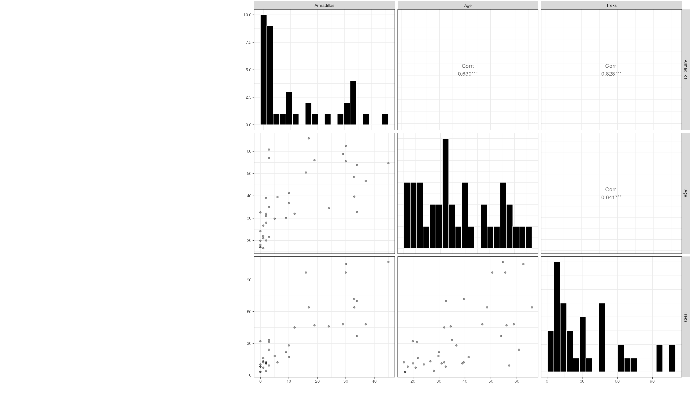{width=85%}

{width=100%}

The pairwise plots reveal positive correlations between all three variables. Notably:

- **Armadillos ~ Age:** Correlation = 0.639 (***) — older hunters tend to encounter more armadillos.
- **Armadillos ~ Treks:** Correlation = 0.828 (***) — hunters who go on more treks encounter substantially more armadillos.
- **Age ~ Treks:** Correlation = 0.641 (***) — age and treks are themselves correlated, which will be relevant for multicollinearity assessment.

---

## Model Selection and Diagnostics

### Poisson Model Diagnostics

The initial Poisson model was fit and evaluated using the Diagnostics tab.

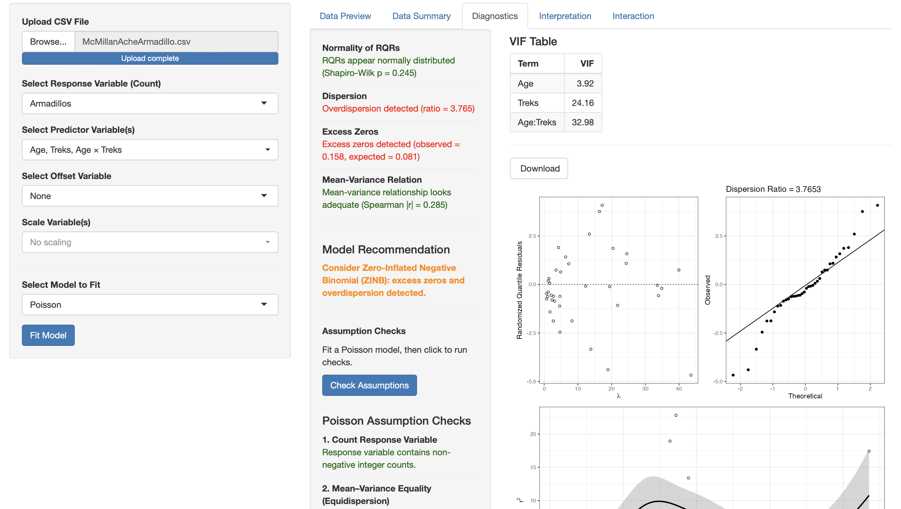{width=90%}

The Poisson diagnostics flagged several problems:

- **Normality of RQRs:** Shapiro-Wilk p = 0.245 — RQRs appear normally distributed 
- **Dispersion:** Overdispersion detected (ratio = **3.765**) 
- **Excess Zeros:** Excess zeros detected (observed = 0.158, expected = 0.081) 
- **Mean-Variance Relation:** Spearman |r| = 0.285 — adequate 
- **Model Recommendation:** *Consider Zero-Inflated Negative Binomial (ZINB): excess zeros and overdispersion detected.*

### Poisson Assumption Checks

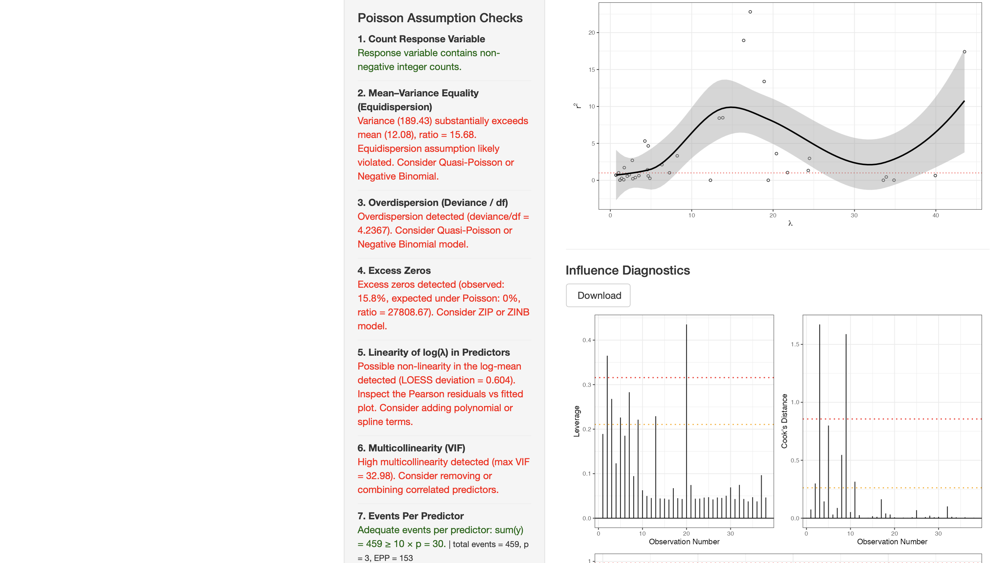{width=90%}

The full Poisson assumption checks confirm:

1. Response variable contains non-negative integer counts.
2. **Equidispersion violated** — variance (189.43) far exceeds mean (12.08), ratio = 15.68.
3. **Overdispersion confirmed** — deviance/df = 4.24. Consider Quasi-Poisson or Negative Binomial.
4. **Excess zeros** — observed 15.8%, expected under Poisson: 0%. Consider ZIP or ZINB.
5. **Possible non-linearity** in log(λ) — LOESS deviation = 0.604.
6. **High multicollinearity** — max VIF = 32.98 (driven by the interaction term).
7. Adequate events per predictor (EPP = 153).

### Goodness of Fit and Influence

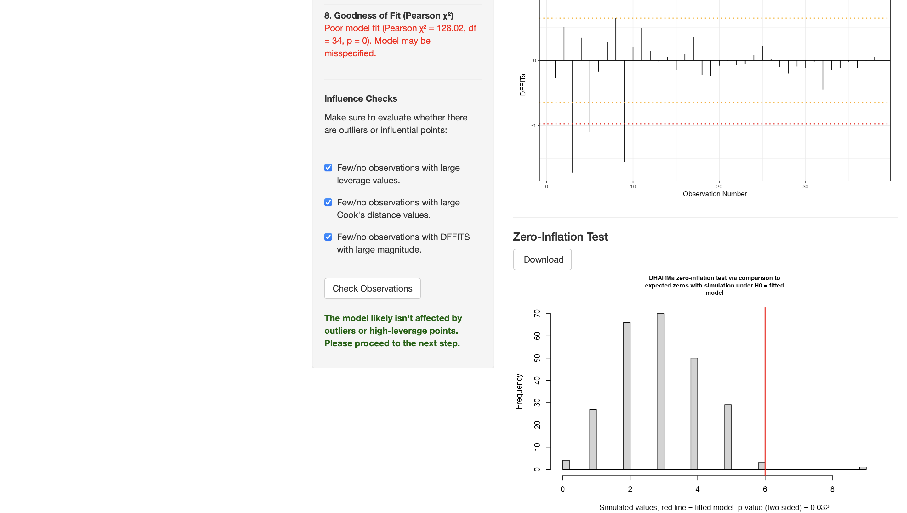{width=90%}

- **Goodness of fit:** Poor model fit (Pearson χ² = 128.02, df = 34, p = 0) — the Poisson model is misspecified.
- **Influence checks:** Few/no observations with large leverage, Cook's distance, or DFFITS values 
- **Zero-inflation test (DHARMa):** p = 0.032 — borderline evidence of excess zeros.

---

## Negative Binomial Model

Given the overdispersion detected under Poisson, a **Negative Binomial** model was fit instead.

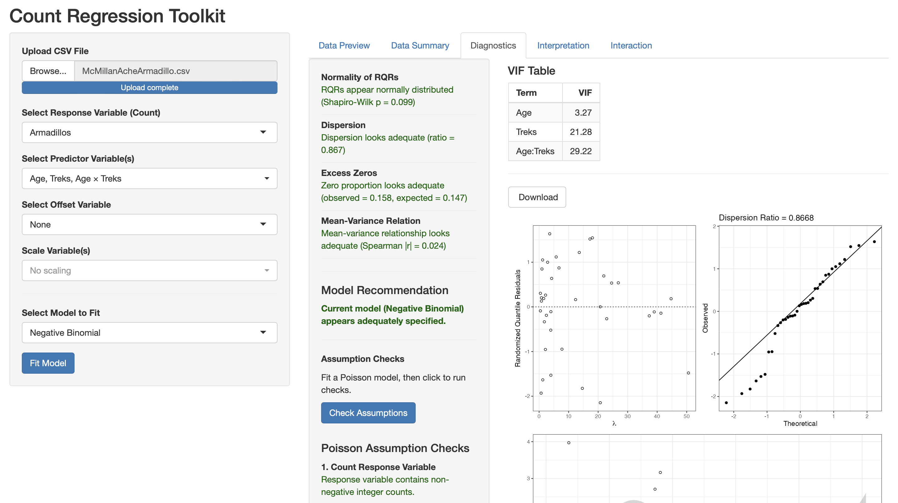{width=90%}

The Negative Binomial diagnostics show substantial improvement across all checks:

- **Normality of RQRs:** Shapiro-Wilk p = 0.099 — RQRs appear normally distributed 
- **Dispersion:** Ratio = **0.867** — dispersion looks adequate 
- **Excess Zeros:** Observed = 0.158, expected = 0.147 — zero proportion looks adequate 
- **Mean-Variance Relation:** Spearman |r| = 0.024 — adequate 
- **Model Recommendation:** *Current model (Negative Binomial) appears adequately specified.* 

---

## Interpretation

### Incidence Rate Ratios

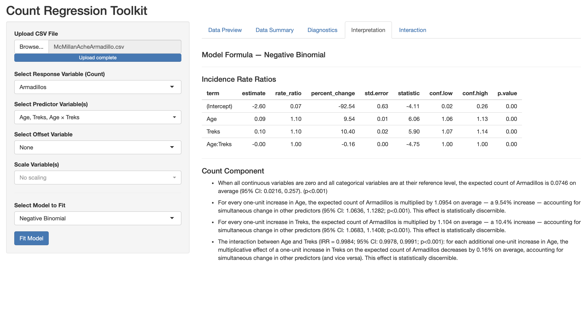{width=90%}

The Negative Binomial model results yield the following **Incidence Rate Ratios (IRRs)**:

| Term | Estimate | IRR | % Change | p-value |
|------|----------|-----|----------|---------|
| (Intercept) | -2.60 | 0.07 | -92.54% | < 0.001 |
| Age | 0.09 | 1.10 | +9.54% | < 0.001 |
| Treks | 0.10 | 1.10 | +10.40% | < 0.001 |
| Age:Treks | -0.00 | 1.00 | -0.16% | < 0.001 |

**Interpretation of each term:**

- **Age:** For every one-unit increase in age, the expected count of armadillos is multiplied by 1.10 — a 9.54% increase — holding treks constant (95% CI: 1.06, 1.13; p < 0.001).

- **Treks:** For every one-unit increase in treks, the expected count of armadillos is multiplied by 1.10 — a 10.4% increase — holding age constant (95% CI: 1.07, 1.14; p < 0.001).

- **Age × Treks interaction:** The multiplicative effect of treks on armadillo count decreases by 0.16% for each additional year of age (IRR = 0.9984; 95% CI: 0.9978, 0.9991; p < 0.001). Although small in magnitude, this interaction is statistically significant — the effect of treks depends on the hunter's age.

---

## Interaction Analysis

To further understand the significant Age × Treks interaction, the interaction was examined using simple slopes, estimated marginal means, marginal effects (emtrends), and a Johnson-Neyman plot. The moderator variable is Age and the focal predictor is Treks.

### Simple Slopes Visualization

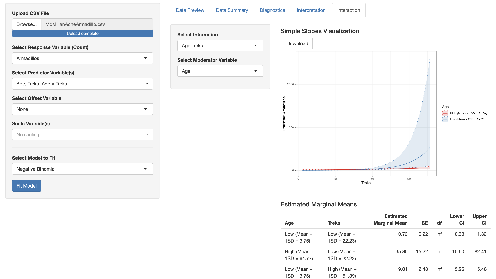{width=85%}

The simple slopes plot shows predicted armadillo counts as a function of Treks, separately for hunters with low age (Mean − 1SD = 22.23) and high age (Mean + 1SD = 51.89). The slope for low-age hunters is substantially steeper than for high-age hunters, indicating that the positive effect of treks on armadillo encounters is stronger among younger hunters. Both lines increase with treks, but the low-age group shows considerably more uncertainty at higher trek values.

---

### Estimated Marginal Means

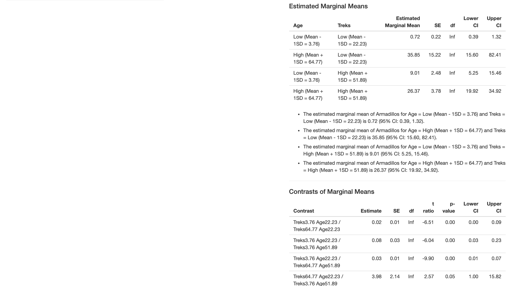{width=90%}

The estimated marginal means of Armadillos at the four combinations of Age (±1SD) and Treks (±1SD) are:

| Age | Treks | Est. Marginal Mean | SE | Lower CI | Upper CI |
|-----|-------|-------------------|-----|----------|----------|
| Low (Mean − 1SD = 3.76) | Low (Mean − 1SD = 22.23) | 0.72 | 0.22 | 0.39 | 1.32 |
| High (Mean + 1SD = 64.77) | Low (Mean − 1SD = 22.23) | 35.85 | 15.22 | 15.60 | 82.41 |
| Low (Mean − 1SD = 3.76) | High (Mean + 1SD = 51.89) | 9.01 | 2.48 | 5.25 | 15.46 |
| High (Mean + 1SD = 64.77) | High (Mean + 1SD = 51.89) | 26.37 | 3.78 | 19.92 | 34.92 |

**Interpretation:**

- When Age is low (3.76) and Treks is low (22.23), the estimated marginal mean of Armadillos is 0.72 (95% CI: 0.39, 1.32).
- When Age is high (64.77) and Treks is low (22.23), the estimated marginal mean is 35.85 (95% CI: 15.60, 82.41) — a large increase driven by age alone at low trek frequency.
- When Age is low (3.76) and Treks is high (51.89), the estimated marginal mean is 9.01 (95% CI: 5.25, 15.46).
- When Age is high (64.77) and Treks is high (51.89), the estimated marginal mean is 26.37 (95% CI: 19.92, 34.92).

---

### Contrasts of Marginal Means

All pairwise contrasts between the four Age × Treks combinations were statistically significant except the comparison between High Age/Low Treks and High Age/High Treks (t = 0.74, p = 0.88), suggesting that at high ages, the number of treks has little additional impact on predicted armadillo counts.

Notable contrasts:

- **Treks3.76 Age22.23 / Treks64.77 Age22.23:** t = −6.51, p < 0.0001 (95% CI: 0.00, 0.09) — significant.
- **Treks3.76 Age22.23 / Treks3.76 Age51.89:** t = −6.04, p < 0.0001 (95% CI: 0.03, 0.23) — significant.
- **Treks64.77 Age22.23 / Treks3.76 Age51.89:** t = 2.57, p = 0.0499 (95% CI: 1.00, 15.82) — marginally significant.
- **Treks3.76 Age51.89 / Treks64.77 Age51.89:** t = −4.03, p = 0.0003 (95% CI: 0.17, 0.68) — significant.

---

### Marginal Effects (emtrends)

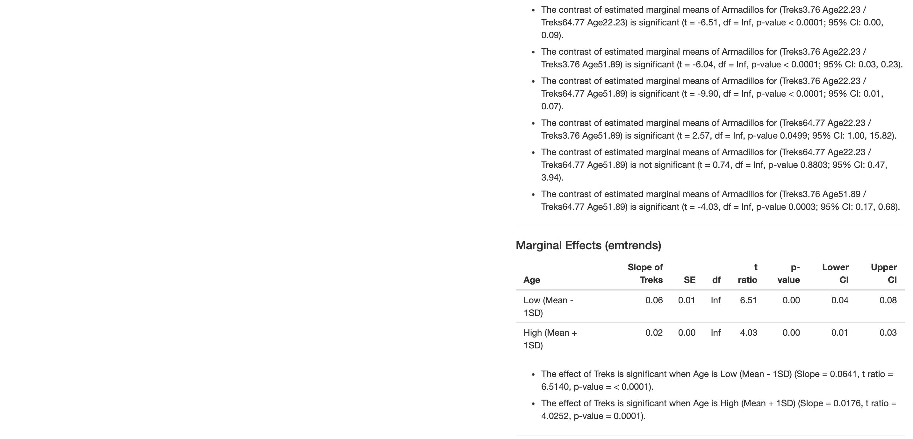{width=90%}

The marginal effects (slopes of Treks) at low and high levels of Age are:

| Age | Slope of Treks | SE | t ratio | p-value | Lower CI | Upper CI |
|-----|---------------|-----|---------|---------|----------|----------|
| Low (Mean − 1SD) | 0.06 | 0.01 | 6.51 | < 0.0001 | 0.04 | 0.08 |
| High (Mean + 1SD) | 0.02 | 0.00 | 4.03 | 0.0001 | 0.01 | 0.03 |

- The effect of Treks is significant when Age is low (Mean − 1SD): Slope = 0.0641, t = 6.51, p < 0.0001.
- The effect of Treks is significant when Age is high (Mean + 1SD): Slope = 0.0176, t = 4.03, p = 0.0001.

Although the effect of Treks is significant at both levels of Age, it is meaningfully stronger for younger hunters — the slope at low age is approximately 3.6 times larger than at high age.

---

### Contrasts of Marginal Effects

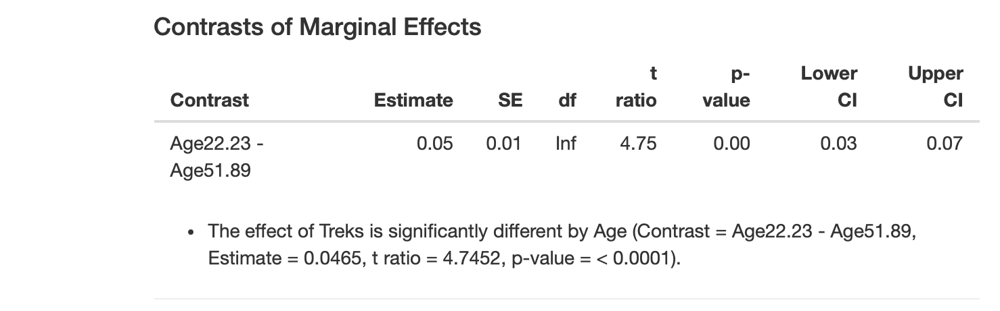{width=70%}

The contrast between the two slopes confirms that the effect of Treks differs significantly by Age:

| Contrast | Estimate | SE | t ratio | p-value | Lower CI | Upper CI |
|----------|----------|----|---------|---------|----------|----------|
| Age22.23 − Age51.89 | 0.05 | 0.01 | 4.75 | < 0.0001 | 0.03 | 0.07 |

The effect of Treks is significantly different between low and high Age groups (Estimate = 0.0465, t = 4.75, p < 0.0001), confirming that the interaction is meaningful: younger hunters show a substantially stronger positive relationship between treks and armadillo encounters than older hunters.

---

### Johnson-Neyman Plot

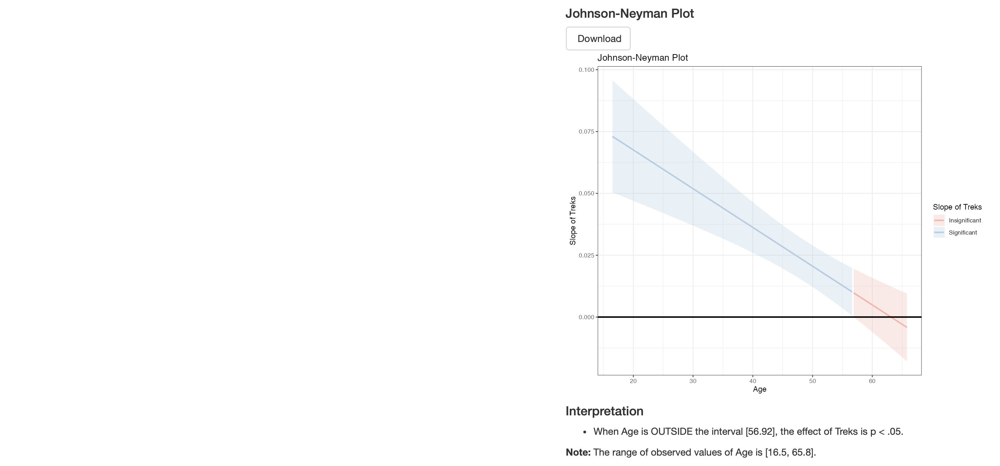{width=85%}

The Johnson-Neyman plot displays the slope of Treks as a continuous function of Age, with shading indicating regions of statistical significance (blue = significant, red = insignificant).

**Interpretation:**

- When Age is outside the interval [56.92], the effect of Treks is p < .05.
- The range of observed Age values is [16.5, 65.8].

This means the positive effect of Treks on armadillo counts is statistically significant for most of the observed age range, but becomes non-significant at the upper tail — roughly for hunters older than 56.92 years. Younger hunters show a reliably stronger relationship between trek frequency and armadillo encounters.

---

## Summary

Trek frequency and age are both statistically significant predictors of armadillo encounters, and they interact. A Negative Binomial regression model was necessary to account for the overdispersion detected under the initial Poisson model (dispersion ratio = 3.77 under Poisson, 0.87 under Negative Binomial). Once the Negative Binomial model was adopted, all major diagnostic checks passed. Researchers studying armadillo encounter rates should account for both how often hunters go out and their age, as these factors jointly predict wildlife encounters.
